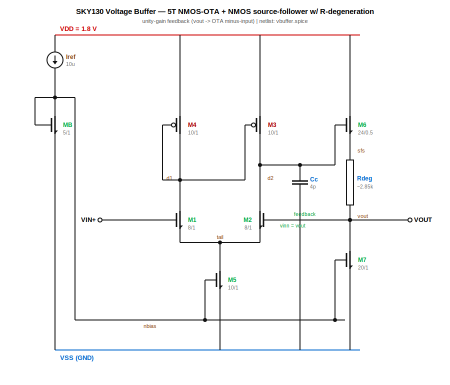
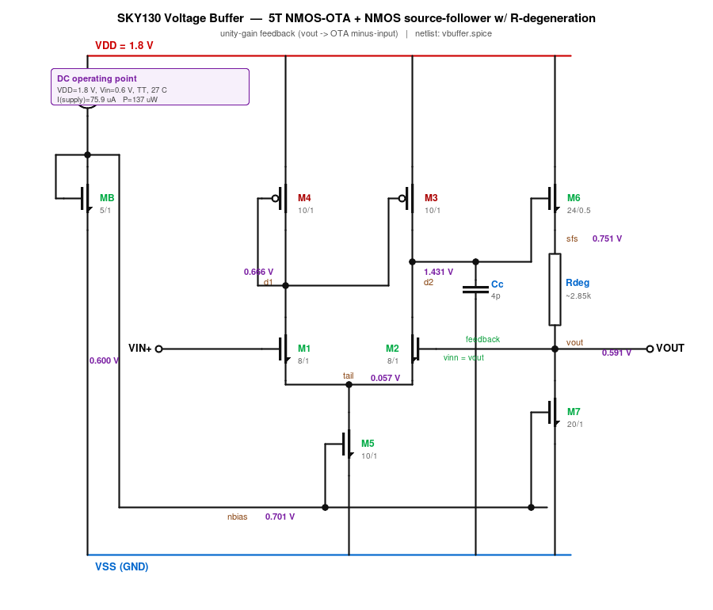
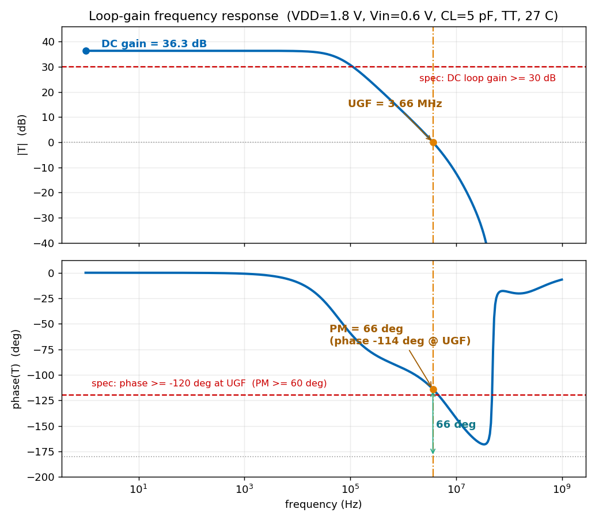
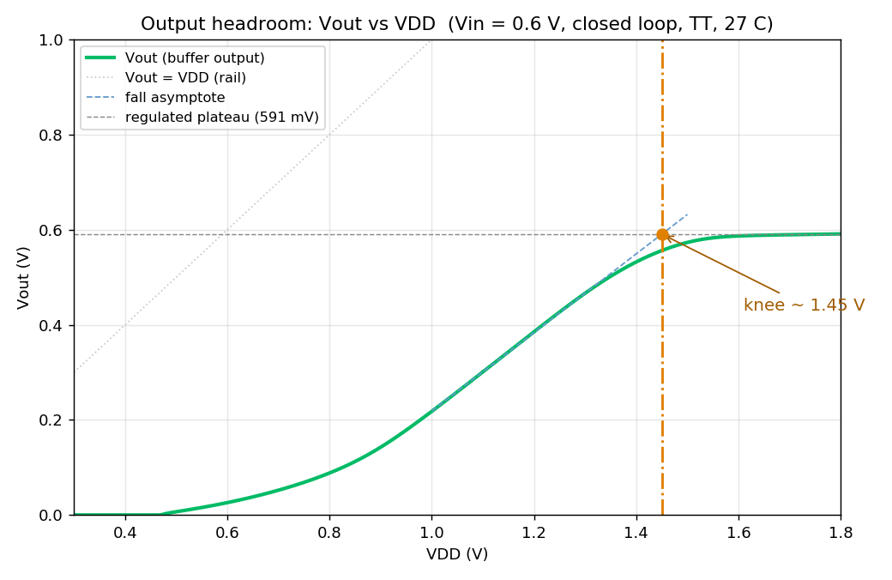
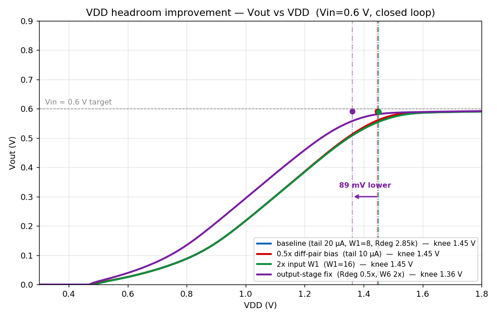

# Unity-Gain Voltage Buffer — SkyWater SKY130 (130 nm, 1.8 V)

A closed-loop unity-gain voltage buffer (analog "voltage follower") designed and
simulated in the fully open-source **SkyWater SKY130** 130 nm process at **1.8 V**.

Everything here is reproducible with open tools — `ngspice` and the open
[SKY130 PDK](https://github.com/google/skywater-pdk) (`sky130_fd_pr` device models) —
and contains no proprietary data.

---

## Architecture



**DC operating point** (VDD = 1.8 V, Vin = 0.6 V, TT, 27 °C, I_supply = 75.9 µA):



| Block | Devices | Function |
|-------|---------|----------|
| **5T OTA** | NMOS diff pair `M1/M2`, PMOS mirror load `M3/M4`, NMOS tail `M5` | single-stage transconductance amplifier |
| **Output stage** | NMOS source follower `M6` + poly resistor `Rdeg` + current sink `M7` | low-impedance output; `Rdeg` (source/emitter degeneration) sets a defined output node and aids stability |
| **Bias** | ideal `Iref` → diode `Mb` → mirror | `Iref` (10 µA) mirrored to the tail (×2) and the output sink (×4) |
| **Compensation** | `Cc = 4 pF` at the OTA output `d2` | dominant-pole compensation |

**Feedback:** the bottom of `Rdeg` (= `VOUT`) drives the current sink and feeds back to
the OTA negative input (`vinn`), closing the unity-gain loop. The input pair and
follower use the **low-Vt** flavor (`nfet_01v8_lvt`) to recover input-common-mode and
output headroom on the 1.8 V rail.

---

## Specifications & simulation results

Operating point: **VDD = 1.8 V, Vout = 0.6 V, CL = 5 pF, 27 °C, typical corner.**
Loop gain measured by series voltage injection (`T = −v(vout)/v(vinn)`); offset 1σ from
a 300-point device-mismatch Monte-Carlo (`tt_mm`).

| Parameter | Spec (target) | Simulated |
|-----------|---------------|-----------|
| Supply voltage | 1.8 V | 1.8 V |
| Quiescent current | < 100 µA | **76 µA** |
| **Power** | < 200 µW | **137 µW** |
| **DC loop gain** | > 30 dB | **36.3 dB** |
| **Phase margin** | > 60° | **66°** |
| Unity-gain frequency | — | **3.66 MHz** |
| Closed-loop bandwidth (−3 dB) | — | **5.72 MHz** |
| **Settling, 0.1%** (100 mV step) | < 400 ns | **249 ns** |
| Overshoot | < 15 % | **7.7 %** |
| Slew rate (up / down) | — | **3.7 / 2.7 V/µs** |
| **Output noise, RMS** (1 Hz–1 GHz) | — | **199 µVrms** |
| Systematic offset @ 0.6 V | — | **−9.1 mV** |
| **Offset 1σ** (MC mismatch) | < 5 mV | **3.5 mV** |
| **Output range** (gain 0.95–1.05) | — | **0.15 – 0.75 V** |
| Active device area Σ(W·L) | — | **84 µm²** (+ 4 pF comp cap) |

### Loop-gain frequency response

Series voltage injection in the feedback path (`T = −v(vout)/v(vinn)`). Red dashed
lines are the stability specs; the orange marker is the unity-gain crossover.



DC loop gain **36.3 dB**, unity-gain frequency **3.66 MHz**, phase at crossover
**−114°** → **phase margin 66°** (spec ≥ 60°). Reproduce with
`ngspice -b tb_loopgain.spice`.

### Process-corner results (Vout = 0.6 V)

| Corner | Power | Sys. offset | Loop gain | UGF | Phase margin |
|--------|-------|-------------|-----------|-----|--------------|
| SS | 133 µW | +9.6 mV | 36.1 dB | 3.24 MHz | 68.5° |
| TT | 137 µW | +9.1 mV | 36.3 dB | 3.66 MHz | 66.0° |
| FF | 140 µW | +8.5 mV | 36.5 dB | 4.06 MHz | 63.8° |

Phase margin stays 64–69° and gain ≈ 36 dB across corners → robust.

---

## Design notes

- **Output range is the lower part of the rail (≈ 0.15–0.75 V).** The NMOS input pair
  needs a relatively *high* common mode, while the NMOS source follower can only pull
  the output *up* to about `VDD − Vgs6 − I·Rdeg` (worsened by body effect). The usable
  window is therefore the lower portion of the supply — intrinsic to an
  NMOS-input / NMOS-follower buffer. A deep-nwell follower (bulk = source) or a
  complementary output stage would extend the high side.

- **Supply headroom — what sets the knee.** Holding `Vin = 0.6 V` and sweeping VDD
  downward, the output tracks the input down to a **knee at VDD ≈ 1.45 V**, then
  collapses toward ground. The cause is a **stacked-headroom limit at the source-
  follower gate `d2`**, which is the OTA's high-impedance output node:

  To hold `Vout = 0.6 V`, the follower `M6` must sit at
  `d2 = Vout + I·Rdeg + Vgs6`. From the DC operating point that is
  `0.59 + 0.16 + 0.68 ≈ 1.43 V` — i.e. **`d2` has to be driven to within ~0.37 V of
  the 1.8 V rail**. The PMOS mirror load (`M3`) can only pull `d2` that high while it
  stays saturated, needing `VDD − d2 > |Vdsat,M3|`. As VDD falls toward ~1.45 V, `d2`
  pins against the top rail (`d2 → VDD`), `M3` drops into triode, the OTA loses gain,
  `M6`'s gate drive stops rising — and `Vout` can no longer follow. Measured `d2`:
  **1.431 V @ VDD 1.8 → 1.395 V @ 1.45 → 1.198 V (= rail) @ 1.2**. So the knee is a
  **top-rail / PMOS-mirror headroom limit**, not an input-pair or tail limit. It moves
  with the held output: a lower `Vout` target pushes the knee to a lower VDD. A
  deep-nwell follower (no body effect → smaller `Vgs6`) or a PMOS/complementary output
  would relax it. Reproduce with `ngspice -b tb_vdd_headroom.spice`.



- **Bias reference.** There is no external `Vref` node — the circuit self-biases. The
  ideal 10 µA `Iref` into the diode-connected `MB` sets the gate-bias rail
  **`nbias ≈ 0.70 V`**, which mirrors to the tail (`M5`) and output sink (`M7`). The
  *signal* reference being buffered is simply `Vin` (0.6 V in all sims here).
- **Accuracy** is set by the single-stage 36 dB loop gain (≈ 1.5 % gain error). A
  cascode/gain-boosted first stage would reduce the offset further.
- **The topology ports across nodes and supplies** — only device flavor, sizing, and the
  compensation cap change. (A 3.3 V variant in a 180 nm node follows the same approach,
  operating over the lower ~half of that rail.)

---

## VDD headroom improvement

Because the knee is set by the **output branch** (`d2 = Vout + I·Rdeg + Vgs6` pinning
against the top rail through the PMOS mirror), the effective levers live in the output
stage — not the input pair. The overlay below sweeps VDD (Vin = 0.6 V) for two commonly
proposed input-side changes versus an output-stage fix.



| Variant | Change | Knee VDD | I_supply | Effect on headroom |
|---------|--------|----------|----------|--------------------|
| Baseline | tail 20 µA, W1 = 8, Rdeg ≈ 2.85 kΩ | **1.45 V** | 76 µA | — |
| 0.5× diff-pair bias | `W5 = 5` (tail 20 → 10 µA) | **1.45 V** | 70 µA | **none** (saves power only) |
| 2× input W1 | `W1 = 16` | **1.45 V** | 79 µA | **none** (helps offset, not headroom) |
| Output-stage fix | `Lr = 1` (Rdeg 0.5×) + `W6 = 48` (2×) | **1.36 V** | 76 µA | **−89 mV** knee |

**Takeaway:** halving the diff-pair bias or doubling the input-pair width leaves the
knee essentially unchanged (≈ 1.45 V) — they trade power, gain, bandwidth and offset,
but the source-follower gate still has to reach `Vout + I·Rdeg + Vgs6 ≈ 1.43 V`, so the
top-rail limit is unmoved. Attacking that stack directly — **smaller `Rdeg` drop** (less
`I·Rdeg`) and a **wider follower** (lower `Vgs6`) — pushes the knee ~90 mV lower at the
same supply current. Removing the follower body effect (deep-nwell, bulk = source) or a
PMOS/complementary output stage would extend it further. Reproduce with
`tb_headroom_variants.spice` (edit the `Xbuf` parameter overrides per the header).

## Reproduce

Requires `ngspice` and the open SKY130 PDK (`volare enable --pdk sky130 <version>`).

```sh
cd spice
# point the .lib path at your PDK install:
sed -i "s#PDK_ROOT#$PDK_ROOT#g" *.spice
ngspice -b tb_op_dc.spice       # operating point, power, DC transfer
ngspice -b tb_loopgain.spice    # loop gain, phase margin, UGF
ngspice -b tb_tran.spice        # step settling / overshoot
ngspice -b tb_noise.spice       # integrated output noise
ngspice -b tb_mc_offset.spice   # 300-pt mismatch Monte-Carlo offset (tt_mm)
```

## Files

```
README.md                          this document
schematic/sky130_schematic.svg      schematic (vector) + .png
schematic/sky130_schematic_dc.svg   schematic annotated with DC operating point
doc/schematic_dc.png                annotated schematic (raster)
doc/loopgain_bode.png               loop-gain Bode plot (gain/PM/UGF)
doc/vout_vs_vdd.png                 VDD headroom sweep (Vout vs VDD)
doc/vdd_headroom_improve.png        headroom variant overlay (bias/W1/output-stage)
spice/vbuffer.spice                 parametrized buffer subcircuit
spice/models.spice                  PDK model include (edit PDK path)
spice/tb_*.spice                    testbenches (op/dc, loop gain, transient, noise, MC, VDD headroom)
```

## License

MIT (see `LICENSE`). Uses the open-source SkyWater SKY130 PDK (Apache-2.0).
